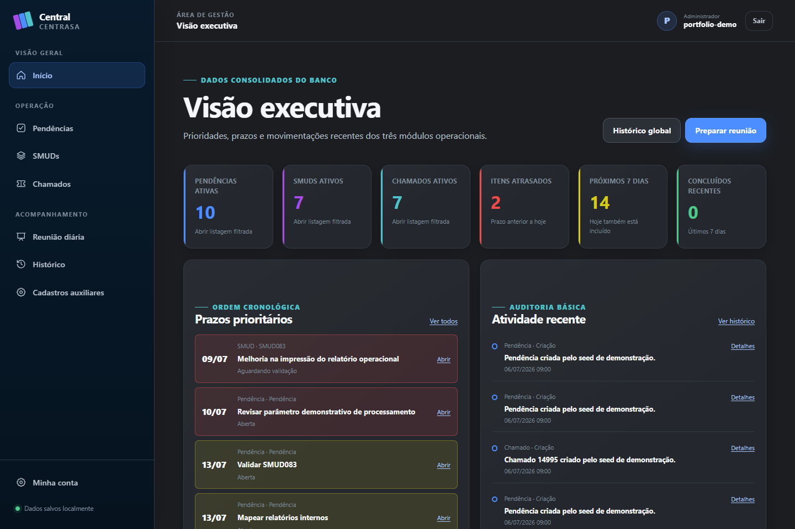
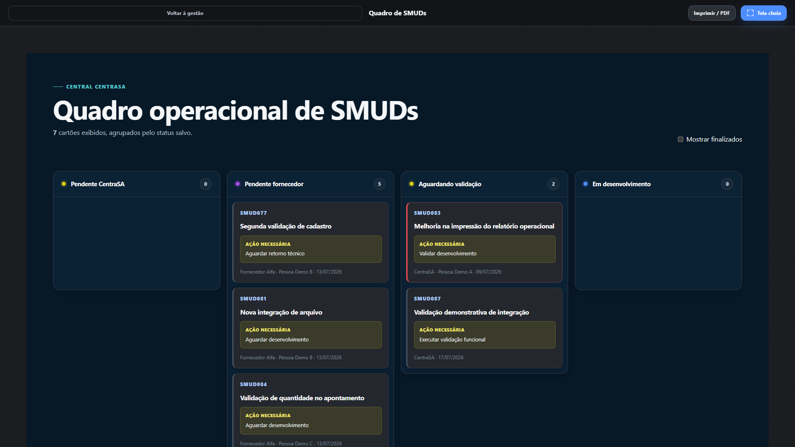
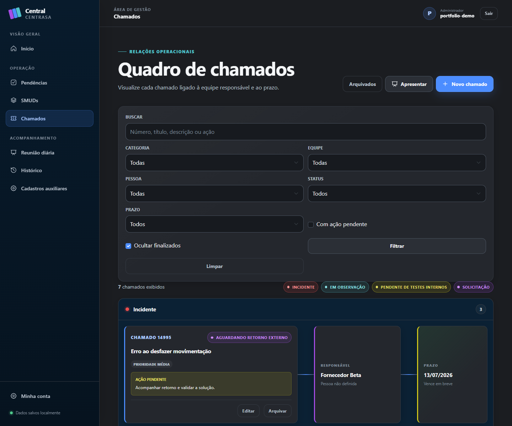

# Central de Pendências e Entregas CentraSA

Aplicação web local para organizar pendências, SMUDs, chamados e reuniões
diárias em uma única interface. O projeto também serve como estudo e portfólio
de ASP.NET Core MVC.

> Estado atual: Marco 11 concluído. A aplicação está preparada para demonstração
> local e portfólio com configuração Production, seed e screenshots sanitizados.
> O Marco 9 foi dispensado; a recuperação é feita por cópia manual do banco.

## Tecnologias

- .NET 8 e ASP.NET Core MVC
- Razor Views
- Entity Framework Core 8 e SQLite
- ASP.NET Core Identity com autenticação local
- xUnit
- Bootstrap local e CSS próprio

## Interface

A interface possui dois contextos visuais:

- **Gestão:** sidebar, topbar, navegação responsiva e componentes operacionais.
- **Apresentação:** layout limpo, tela cheia e impressão/PDF pelo navegador.

Os estilos ficam separados em tokens, base, layout, componentes, páginas e
impressão. Ícones SVG e bibliotecas são servidos localmente, sem CDN.

## Galeria

[](docs/screenshots/dashboard-desktop.png)

| Quadro de SMUDs | Relações de chamados |
|---|---|
| [](docs/screenshots/smuds-board.png) | [](docs/screenshots/ticket-relations.png) |

As seis capturas foram geradas automaticamente a partir de um banco temporário
com dados fictícios. Consulte a [galeria completa](docs/screenshots/README.md) e
o [estudo de caso](docs/portfolio.md).

## Pré-requisitos

- .NET SDK 8.0.414 ou patch compatível da mesma feature band
- Git

Confira o SDK selecionado:

```powershell
dotnet --version
```

## Restaurar, compilar e testar

Após clonar ou extrair o repositório, abra um PowerShell na raiz do projeto:

```powershell
.\V.cmd
.\V.cmd -Configuration Release
```

O script executa restore, build com analisadores, todos os testes e a verificação
de formatação. Use `.\V.cmd -Coverage` para também gerar cobertura XPlat.

## Executar a aplicação base

```powershell
dotnet run --project src/CentraSA.Web
```

Use uma das URLs `localhost` exibidas no terminal. No primeiro acesso, a página
de login encaminha para a criação controlada do único administrador. Não existe
senha padrão.

Em Development, um banco vazio recebe dados demonstrativos sanitizados. As
migrations e os cadastros estruturais são aplicados automaticamente no início.

## Executar em Production local

Production não cria dados demonstrativos e escuta somente no endereço de
loopback informado:

```powershell
$env:ASPNETCORE_ENVIRONMENT = "Production"
$env:Storage__DataDirectory = "$env:LOCALAPPDATA\CentraSA"
dotnet run --project src/CentraSA.Web -c Release --no-launch-profile --urls http://127.0.0.1:5180
```

Abra `http://127.0.0.1:5180`. No primeiro acesso, crie o administrador. A
configuração Production mantém logs reduzidos, seed desabilitado e não expõe o
acesso temporário usado pelo gerador de screenshots.

## Gerenciar pendências

Após entrar, abra **Pendências** no menu lateral. O módulo permite:

- captura rápida e formulário completo;
- busca, filtros por área, status e prazo, com paginação de 50 itens;
- conclusão, reabertura, ordenação e arquivamento sem exclusão física;
- vínculos opcionais com SMUD ou chamado;
- detalhe com histórico das alterações relevantes;
- apresentação em tela cheia inspirada no checklist do Gamma.

Filtros funcionam por URL mesmo sem JavaScript. Quando o navegador permite,
a lista é atualizada sem recarregar toda a página.

## Gerenciar SMUDs

Abra **SMUDs** no menu lateral para usar o quadro agrupado pelo status salvo no
banco. O módulo oferece:

- criação e edição com código normalizado, área, responsável e prioridade;
- filtros por busca, área, pessoa, status, prazo e ação necessária;
- totais derivados dos cartões filtrados de cada coluna;
- indicação de atraso e janela de vencimento nos próximos sete dias;
- detalhe com histórico, arquivamento lógico e restauração;
- apresentação do quadro em tela cheia.

Os códigos aceitam entradas como `smud-84`, mas são gravados como `SMUD084`.
Uma forma normalizada já existente é rejeitada, inclusive se estiver arquivada.

## Gerenciar chamados

Abra **Chamados** para visualizar cada registro na composição
**chamado → responsável → prazo**, agrupada por categoria. O módulo oferece:

- número composto somente por dígitos e protegido contra duplicidade;
- categoria e equipe independentes, com filtros que podem ser combinados;
- filtros adicionais por pessoa, status, prazo, busca e ação pendente;
- indicação de atraso e vencimento próximo;
- detalhe com histórico, arquivamento lógico e apresentação em tela cheia;
- conectores responsivos, horizontais no desktop e verticais em telas estreitas.

Os conectores participam do fluxo do grid e não usam coordenadas absolutas.

## Conduzir a reunião diária

Abra **Reunião diária** e use **Preparar reunião**. O builder sugere itens
atrasados, próximos do prazo e concluídos recentemente, sem repetir uma origem.
Cada seleção recebe uma seção, uma ordem e notas próprias.

O rascunho pode ser editado e apresentado em tela cheia. Durante a reunião é
possível registrar notas, marcar o item como apresentado e concluir sua origem.
Os dados vistos na pauta são guardados como snapshots, portanto continuam
fiéis ao momento da preparação mesmo quando o item original muda. Após a
finalização, a sessão permanece disponível somente para consulta e impressão.

## Consultar dashboard e histórico

A página inicial apresenta contadores derivados diretamente das projeções do
SQLite: itens ativos por módulo, atrasados, próximos prazos, conclusões recentes
e rascunhos de reunião. Cada número é um link para a listagem com o mesmo filtro
que produziu o total.

Em **Histórico**, busca, tipo, ação e intervalo de datas podem ser combinados. A
timeline global abre o detalhe completo de cada registro. Os formulários GET
continuam funcionando sem JavaScript; quando disponível, o navegador atualiza
somente a lista de resultados.

## Gerenciar cadastros auxiliares

Em **Cadastros auxiliares** é possível criar, editar, ativar e desativar áreas,
equipes, pessoas, status e categorias. As alterações geram eventos de auditoria.
Escopos de referências em uso são protegidos e cada módulo mantém exatamente um
status ativo de conclusão.

## Estrutura

```text
src/
  CentraSA.Domain          Regras e modelo de domínio
  CentraSA.Application     Casos de uso e portas
  CentraSA.Infrastructure  Persistência e integrações locais
  CentraSA.Web             ASP.NET Core MVC e Razor Views
tests/
  CentraSA.UnitTests
  CentraSA.IntegrationTests
docs/
  Decisões e documentação técnica
```

A direção das dependências está documentada em
[`docs/architecture.md`](docs/architecture.md).

## Dados locais e segurança

O banco fica em `%LOCALAPPDATA%\CentraSA\Data\centrasa.db` e as chaves de
proteção ficam sob a mesma raiz, fora do repositório. A aplicação não cria
backups automáticos. Bancos, cópias manuais, secrets, credenciais e dados
operacionais reais não devem ser versionados.

Para usar outra raiz local durante desenvolvimento:

```powershell
$env:Storage__DataDirectory = "C:\dados\CentraSA"
dotnet run --project src/CentraSA.Web
```

## Ferramentas e migrations

```powershell
dotnet tool restore
dotnet tool run dotnet-ef migrations list --project src/CentraSA.Infrastructure --startup-project src/CentraSA.Web
```

As instruções completas estão no [manual local](docs/manual-local.md).

## Documentação

- [Arquitetura](docs/architecture.md)
- [Modelo de dados](docs/data-model.md)
- [Manual local](docs/manual-local.md)
- [Checklist do release candidate](docs/release-checklist.md)
- [Limitações conhecidas](docs/limitations.md)
- [Material de portfólio](docs/portfolio.md)
- [Atualização planejada para .NET 10](docs/dotnet10-upgrade.md)
- [Roadmap](docs/roadmap.md)
- [Como contribuir](CONTRIBUTING.md)

## Licença

Distribuído sob a licença [MIT](LICENSE).
