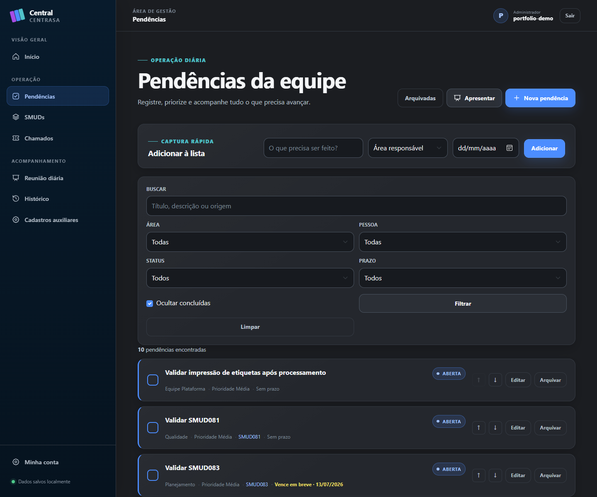
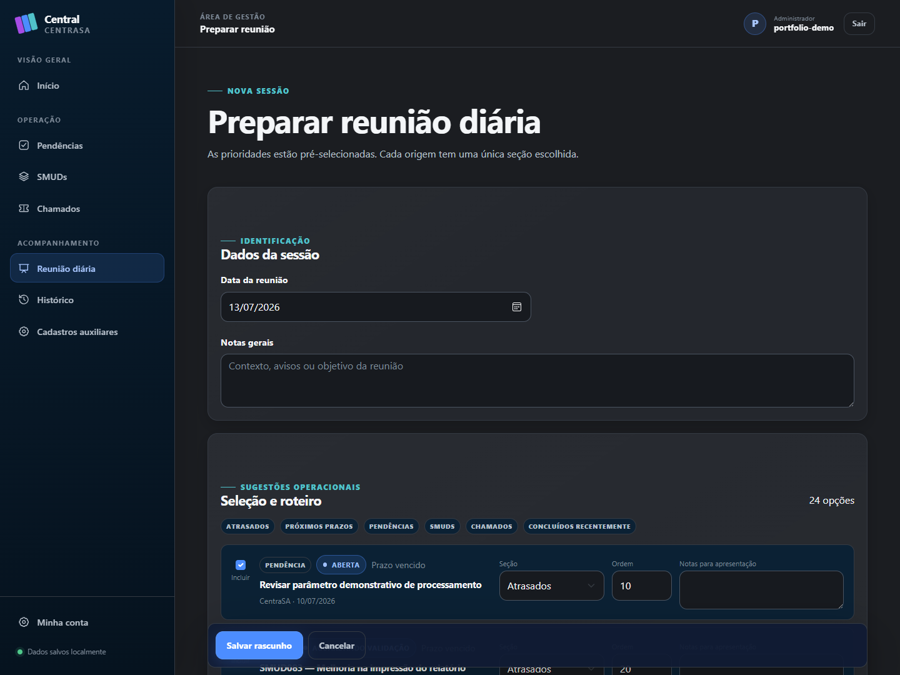
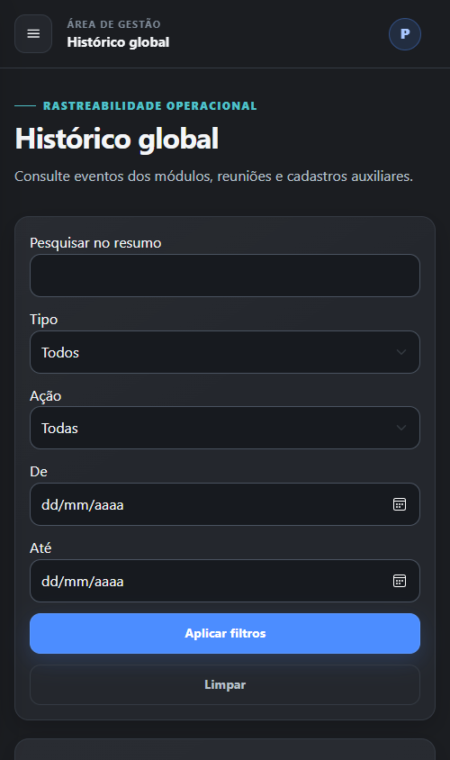

# Screenshots sanitizados

As imagens abaixo foram capturadas da aplicação real em Release. O gerador usa
um SQLite temporário, seed fictício, administrador descartável e remove a raiz
de dados ao terminar.

## Galeria

### Dashboard executivo


### Pendências



### Quadro de SMUDs


### Relações de chamados


### Preparação da reunião



### Viewport estreita



## Regenerar

Pré-requisitos adicionais: Node.js 22 ou superior e Google Chrome ou Microsoft
Edge. Depois do build Release:

```powershell
dotnet build CentraSA.sln -c Release
node scripts/capture-portfolio.mjs
```

O acesso automático existe somente em Development, exige loopback, token
aleatório e uma das seis rotas permitidas. Ele não é registrado em Production.
Antes de publicar novas imagens, execute `scripts\audit-portfolio.cmd` e faça
uma inspeção visual dos textos e metadados.
